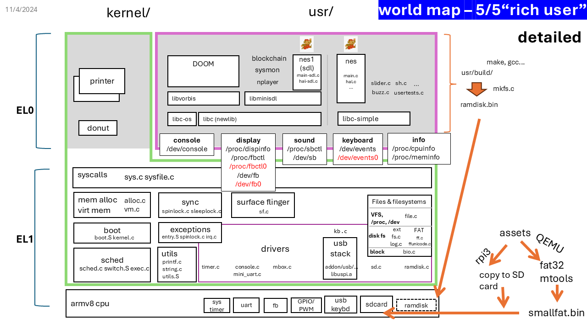
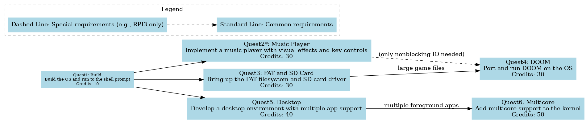
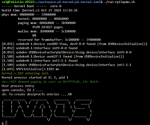
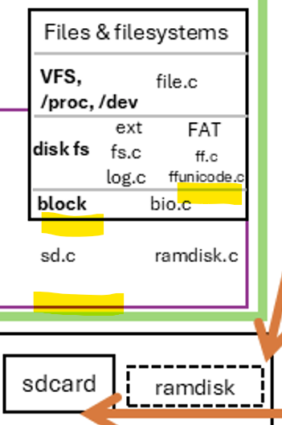
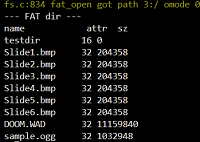

# Quests of Kernel Lab5 "Rich User"

Total estimated time: XXX hours

**NOTE**. For picture/video 😙 DELIVERABLEs, see [requirements](./submission.md).

**NOTE**. In this lab, the codebase is much more complex than in previous labs. 
To avoid getting lost, consider the following:
1. Use VS Code, especially its code jump features and plugins: `Bookmarks`, `TODOs`, etc.
2. Refer to the "worldmap" that we provide.



| Quest | Short Description | Credits |
|-------|-------------------|---------|
| 🗺️ Quest1: build | Build the OS and run to the shell prompt | 10 |
| 🗺️ Quest2*: music player | Implement a music player with visual effects and key controls | 30 |
| 🗺️ Quest3: FAT and sdcard | Bring up the FAT filesystem and SD card driver | 30 |
| 🗺️ Quest4: DOOM | Port and run DOOM on the OS | 30 |
| 🗺️ Quest5: Desktop | Develop a desktop environment with multiple app support | 40 |
| 🗺️ Quest6: Multicore | Add multicore support to the kernel | 50 |

*=rpi3 only; cannot be done on QEMU

#### Total credits: 190
Credits exceeding 100 will be considered as bonus.



#### Example paths
- Jukebox (70): build->music player->FAT.  A music player that play your favorite music from the sdcard.
- Doom console (70): build->FAT->DOOM. A console that runs DOOM.
- Multi marios (100): build->Desktop->Multicore. Run multiple instances of mario side by side, on multiple cores.
- Multi DOOMs (130): build->DOOM->Desktop->Multicore. Run multiple instances of DOOM side by side.
- Everything (190): build->music player->FAT->DOOM->Desktop->Multicore. The things you see in my demo. 

## 🗺️ Quest1: build
 
The given OS can already boot to the shell prompt.

Fetch the lab code and the libc (called `newlib`) code, which are two separate repositories.
Build the whole OS and run to the shell prompt -- for either QEMU or rpi3 hardware. 

The code layout should look like: 
```
(home)
    +--- newlib
    +--- uva-os-world5
```
Then build the OS as before. 

😙 DELIVERABLE: take a photo of the shell prompt. Reference below. 



## 🗺️ Quest2: music player (rpi3 ONLY)

**NOTE**. THIS IS ONLY FOR RPI3; NOT FOR QEMU, which lacks sound hardware emulation. 
This best QEMU can do is to display visual effect. 

OVERVIEW: a music player that plays .ogg file and renders the visual effect of the spectrum on display. 

The player will use multiple threads to load sound buffer and render the visual effect.

- Grasp the idea of the nplayer source (usr/nplayer)
    - usr/nplayer/Makefile for its library dependencies
    - usr/nplayer/nplayer.c for its main logic. 

> The sub-quests below can be done in parallel.

### SUB-QUEST: sound effect 

#### bring up threading (via clone() syscall)

- Read usr/usertests.c, understand `clonetest()`, in particular how it allocates stacks for the new threads. **If you run into threading bugs in the future**, come back to this step to check your understanding. 

- complete the path of `clone()`: `clone` in (user) usr/libc-simple/usys.S -> (kernel) 
  sys_call_table -> `sys_clone()` and then `copy_process()`. 
Note how the stack for a new thread is passed all the way down to `copy_process()` in the kernel. 
  You have done syscall path before; but this one can be tricky because of the stack handling.

- In `copy_process()`, complete the brach that handles PF_UTHREAD (for forking a user thread). 

- Run `usertests clonetest` from shell and pass the test. 

CHECKPOINT (not a DELIVERABLE): take a screenshot of the shell showing the test passed. 

- Port the user stub code (`clone()`) from  usr/libc-simple/usys.S to usr/libc-os/usys.S which will be used by nplayer. 

#### Sound playback
 
The SDL (simple directmedia layer) code is at `usr/libminisdl/`. 

- Grasp the structure of the SDL source code. Start from its Makefile. 

- Understand sdl-audio.h.

- In audio.c, complete the `clone()` call for creating a worker thread with its proper stack; 
complete the thread code `thread_func()` for refilling the sound buffer via /dev/sb. 

- In nplayer/nplayer.c, complete `FillAudio()` for the actual sound buffer filling.

- In nplayer.c, complete main() for loading a music file. 

CHECKPOINT: compile nplayer with HAS_VISUAL=0, player it with a sample *.ogg file, and hear the sound.

### SUB-QUEST: UI

#### Visual effect 
- Complete key SDL graphics API in `usr/libminisdl/video.c` for drawing the spectrum: setpixel(), SDL_RenderClear(), and SDL_RenderDrawLine(). 

- In nplayer.c, add locks to visualeffect() to protect the shared data.
Add call to visualeffect() in the main loop of main().

CHECKPOINT: enjoy the visual effect of the spectrum on the screen. 

#### Key control (nonblocking IO)

To support nplayer to handle key inputs as it plays music, the OS needs to support nonblocking IO via the O_NONBLOCK flag in `open()`

User side: 

- In `usr/libminisdl/events.c`, complete `SDL_PollEvent()` to open /dev/events in a nonblocking mode.

- In `usr/libc-os/io.c`, complete `read_kb_event()` which read a key event from /dev/events. The logic is mostly identical to `read_kb_event()` in `usr/libc-simple/uio.c`; only some C APIs may differ. 

Kernel side: 

- syscall layer: in `sys_open()` (sysfile.c), check O_NONBLOCK and assign file::nonblocking accordingly.

- file layer: in `fileread()`, on the branch for reading file type FD_DEVICE, 
pass along the nonblocking flag to the underlying device driver. 

- keyboard driver layer: in `kb_read()`, check the argument `blocking`; if it is false, return immediately if no key event is available.

CHECKPOINT: compile nplayer with HAS_VISUAL=0, play it with a sample *.ogg file, and use the USB keyboard to pause/resume the music as well as tuning up/down the volume.

😙 DELIVERABLE: take a video showing the music player playing a music file, with the visual effect of the spectrum on the screen.


## 🗺️ Quest3: FAT

OVERVIEW: bring up the FAT filesystem and sdcard driver.

- This quest is  feasible on both QEMU and rpi3.

- This quest is a prerequisite for DOOM, as it requires to load large WAD files which are better from an sdcard. 

- This quest is "nice to have" for nplayer and slider. 
With it done, you can copy numerous music files and images to an sdcard, from the PC/Mac, and play them on the OS.

Relevant portion of the world map; the interfaces we will modify are highlighted.



### SD card driver

Complete key pieces in sd.c

- Add call to `sd_init()` in `kernel_main()` to initialize the driver. 

- Understand `test_sd()` in unittests.c. Add a call to it in `kernel_process()`.

- Prepare a SD card. 
    
    - (rpi3) Use the same SD card you have been using. In addition to the 1st partition ("bootfs"), add a 2nd partition and format it as a FAT32 filesystem (if there is no 2nd partition yet). Use AI for instructions.

    - (QEMU) Create a disk image file with FAT32. [Instructions](diskimg.md).

- Build and boot the kernel. Check if `test_sd()` can detect the sdcard and read/write blocks from/to it.

CHECKPOINT: check the shell showing the test output. [Reference output](reference-output.md).

### Integrate the SD driver with the kernel block layer. 

- In sd.c, complete `sd_part_rw()` and its friends to read/write one block from/to the sdcard. 

- In bio.c: 
    - add a branch to bread(): if the storage device is an SD card, call `sd_part_rw()`.
    - add a branch to bwrite(): if the storage device is an SD card, call `sd_part_rw()`.

### Integrate FAT32 with the the kernel block layer. 

- Roughly understand "ffconf.h" and "ff.c". In the kernel source, search for "CONFIG_FAT" to see how 
FAT32 is integrated into the file abstractions.

- Add the disk interface for FAT32. In bio.c, complete functions (`disk_read()` and `disk_write()`) that 
read/write blocks from/to the buffer cache, 

<!---- there are many other details, in file.c fs.c sysfile.c. Guess wont have time to cover all. -->

### Integrate FAT32 with kernel file abstractions

- Read `redirect_fatpath()` and how it is called in the kernel. Understand: 
    - how the kernel translates a regular file path to a FAT32 path. 
    - Know that: to access a file path in the FAT32 filesystem (e.g. "ls XXX"), what path should be used for file?

- Intialize the FAT32 filesystem. In `move_to_user_mode()`, call fsinit() with the block device number of the sdcard.

CHECKPOINT: from shell, "ls" the root directory of the sdcard.

😙 DELIVERABLE: take a video showing: the "ls" command listing the root directory of the sdcard;
the "cat" command to show the content of a text file on the sdcard.



Now, load more music (ogg) files and pictures (bmp) to the sdcard and have fun. 


## 🗺️ Quest4: DOOM

OVERVIEW: bring up DOOM (1993) on the OS. We already had all the OS services it needs; what is left is just some glue logic. 

> There is a fantastic book on DOOM's design, culture and interesting stories: [Game engine black book: DOOM](https://fabiensanglard.net/gebbdoom/).

- Have an overall understanding of the DOOM source code. 
    - Start from `usr/doomgeneric/Makefile`. README.TXT (by Carmack) is from the original DOOM repo and README.md contains notes for this quest and for porting doomgeneric. Both worth reading.      
    - Our changes are in `usr/doomgeneric/doomgeneric_minisdl.c`.     
    - **NOTE.** DOOM depends on nonblocking IO for key inputs. If you have not implemented that for quest "music player", first read `handleKeyInput()` in doomgeneric_minisdl.c to understand the needed interface; 
    then complete the "nonblocking IO" part of "music player". 


- Complete more SDL APIs (usr/libminisdl/src)

  - In video.c, complete a few key SDL graphics APIs used by DOOM for rendering: `SDL_RenderCopy()`, `SDL_UpdateTexture()`, and `SDL_RenderClear()` (if you have not done so).
  - In timer.c, complete `SDL_GetTicks()` for DOOM to get the current time.

- In doomgeneric_minisdl.c, complete the few functions (`DG_GetKey`, `handleKeyInput` etc) for handle key events. Optionally, change convertToDoomKey() if you want to remap the keys.

- Compile DOOM and run it.

😙 DELIVERABLE: take a video of DOOM running on the OS. 
Reference picture below (your submission must be a video).


https://github.com/user-attachments/assets/d99da02b-579a-4cad-b847-ba09882540d9


- Replay the built-in demos (demo1, demo2, demo3) and record the FPS at the end. ("doom -timedemo demo1")

😙 DELIVERABLE: take videos of DOOM replaying demo1-3, reporting the FPS at the end.

## 🗺️ Quest5: Desktop

OVERVIEW: bring up a desktop environemnt, so that multiple apps can render to different portions of the screen, 
the user can switch between them, and the "focused" app can receive key inputs.

### Display

We will add the following new user/kernel interfaces:

* /dev/fb0: per-app "window" (the code sometimes to it as a "surface") for rendering, which will be composite by the "surface flinger", a kernel task.
* /proc/fbctl0: per-app framebuffer configuration, via which the app can set the surface size, z-order, transparency, etc. 

* These definitions (/dev/fb0, /deb/fbctl0, etc.) are already added to PROC_DEV_TABLE (fcntl.h)
Change the kernel side:

STEPS: 

Change the kernel side: 

- (kernel) Grasp the idea of "surface flinger" (sf.c). Start from `start_sf()`: 
    - how writes on /dev/fb0 are handled
    - how does the kernel task "sf_task" is created and scheduled
    - the use of sflock (a spinlock) 
    - the role of `sf_struct()` and its fields

- (kernel) Grasp `procfs_parse_fbctl0()`: which/how commands from /proc/fbctl0 are handled. 

- (kernel) Complete: `sf_task()` for its main loop;
`devfb0_write()` for copying the user buffer to a surface's buffer and notify the surface flinger

- (kernel) Grasp `sf_composite()` which is the core of the surface flinger logic. 
Complete it for invalidating cache, and for managing the "dirty" status of surfaces.

- (kernel) in `start_sf()`, launch a kernel task for `sf_task()`.

Change the user side: 

- Test the surface flinger with a simple app. slider.c already contains code for rendering to /dev/fb0 (read its source and comment). 


```bash
# render two slider instances with partial overlap
# (add these to initrc.txt for exec on boot)
$ slider 50 50 -1 -1&
$ slider 100 100 -1 -1&
```

CHECKPOINT: run multiple instances of slider and see them rendered on the screen side by side. 

- Add /dev/fb0 support to SDL. sdl-video.h already has flags for using /deb/fb0. In `SDL_CreateWindow()` in video.c, complete the branch for opening the /dev/fb0 device; also the branch in `SDL_CreateWindow()` for configuring the surface via /proc/fbctl0.

- Test the SDL with /dev/fb0 support with mario. LiteNES/main-sdl.c and hal-sdl.c already have code for rendering to /dev/fb0. Makefile.sdl defines rules for building an executable called "nes1". It now accepets arguments like: 
```bash
# render two nes1 instances side by side
# (add these to initrc.txt for exec on boot)
$ nes1 -- 0 0 &
$ nes1 -- 256 0 &
```

😙 DELIVERABLE: show a video of the mario instances running.

### Key dispatch

We will add a new user/kernel interface:

* /dev/events0: per-app device for read key events. Yet, only the focused app on the "top" (i.e. has zorder=0) can read actual key events.

The kernel side: 

- PROC_DEV_TABLE (fcntl.h) already has the definition for /dev/events0.

- In sf.c, grasp sf_struct::kb and its role. 

- Understand `kb_task()` and how it is created and scheduled. Complete this function for copying key events from the kb device driver's buffer to the focused app's key buffer and waking up the user app.

- Complete `kb0_read()` for reading key events from the current task's buffer and return them to the user.

The user side:

- Test the key dispatch with a simple app. slider.c already contains code for reading key events from /dev/events0. Launch slider like "slider 50 50 -1 -1&". See if you can flip the slides with keys as before. 

CHECKPOINT --- show a video of multiple slider instances running and responding to key inputs.

- SDL support. The SDL code already defines a flag (SDL_EV_SW) for using /dev/event0. In event.c, add code branch to SDL_WaitEvent() so that they open /dev/events0. 

- Test the key dispatch with nes1. 

CHECKPOINT. show a video of multiple mario instances running and responding to key inputs.

Support ctrl+tab key combination to switch the focused app. 

- (kernel) Intercept ctrl+tab key combination to switch the focused app. In sf.c: 
    - add a branch to kb_task() for handling the alt+tab key combination. 
    - complete sf_cycle_focus() for shifting the focus among apps.

😙 DELIVERABLE. 
run multiple instances of mario instances, 
use ctrl+tab to switch among them, and control the focused app. 

### Additional features

Support move the focused surface with the keyboard: 

- In sf.c, grasp and complete `sf_move()`, which changes the locations of the top surface.

- In `kb_task()`, intercept the combination of ctrl + arrow keys and call `sf_move()`. 

CHECKPOINT. move the focused surface with ctrl+arrow keys.

Support transparent surfaces:

- In `sf_composite()`, complete the logic for blending the surfaces with transparency.

😙 DELIVERABLE: a short video of all features implemented.

Reference: 


## 🗺️ Quest6: Multicore
<!-- nov 2024: maybe too simple. much of the complexity is in locking -- left out
but we likley have no time -->

So far, the kernel code has support for 1 core (core0). 
We will add support to run up to 4 cores (core0--3). 

In the code and writeup, "core" and "cpu" are often used interchangeably.
e.g. core0 == cpu0. 

SUB-QUEST: boot 

- Understand how firmware uses an in-memory table to "park" secondary cores.

- Understand the boot sequence of "secondary cores" (core1--3). 


- in boot.S, set up the kernel stacks for core 1--3. 
- in boot.S, check core id (cpuid_reg): 
    - if it is 0, jump to `kernel_main`
    - if it is 1--3, jump to their entry `secondary_core_asm`.

- in kernel.c, complete start_secondary_cores(), which resumes core 1--3 from their parked state.

- in kernel_main(), which is executed by core0 only, add a call to `start_secondary_cores()`.

- read `enable_interrupt_controller()`: understand the "generic timers" interrupts are enabled for all cores (because they are used for schedule ticks);
and interrupts from all other peripherals are handled by core0 only.

- complete secondary_core() so that schedule ticks are on for all secondary 
cores (therefore they will pick up tasks to run).

- in param.h, change NCPU to 4.

CHECKPOINT. build the kernel and run; you should see all cores printing their messages:
```
xzl@FelixLin-XPS15 (main)[p1-kernel-lab5]$ ./run-rpi3qemu.sh 
------ kernel boot ------  core 0
build time (kernel.c) Nov 16 2024 14:52:00
phys mem: 00000000 -- 3f000000
(......) 
[1.667] USPiInitialize():1105 ms
Hello core 2
Hello core 3
kernel.c:189 entering init
Hello core 1
```

SUB-QUEST: measure cpu utilizations

- In `timer_tick()`, add code to measure the cpu utilization of each core.

- In `procfs_gen_content()`, add code to return the cpu utilization of each core
to `/proc/cpuinfo`. 

CHECKPOINT. run the OS and do `cat /proc/cpuinfo` to see the cpu utilization of each core.

- Build `sysmon` (usr/sysmon) and run it (`sysmon 0 0`): it will draw the cpu utilization of each core in real time.


SUB-QUEST: multiple apps on multiple cores

- Build everything and run shell commands like this (you may want to add these commands to initrc.txt). 
Test and debug. 

```
nes1 -- 0 0 &
nes1 -- 256 0 &
nes1 -- 512 0 &
nes1 -- 768 0 &

nes1 -- 0 250 &
nes1 -- 256 250 &
nes1 -- 512 250 &
nes1 -- 768 250 &

sysmon -- 600 600 &
```

😙 DELIVERABLE: a video showing multiple mario instances running on multiple cores.

Reference: 

https://github.com/user-attachments/assets/70de77e9-b78e-42ee-ac27-c295ecbcbddb

https://github.com/user-attachments/assets/3d7bdf38-25d8-46dc-9f1a-8e0624e0c78f


